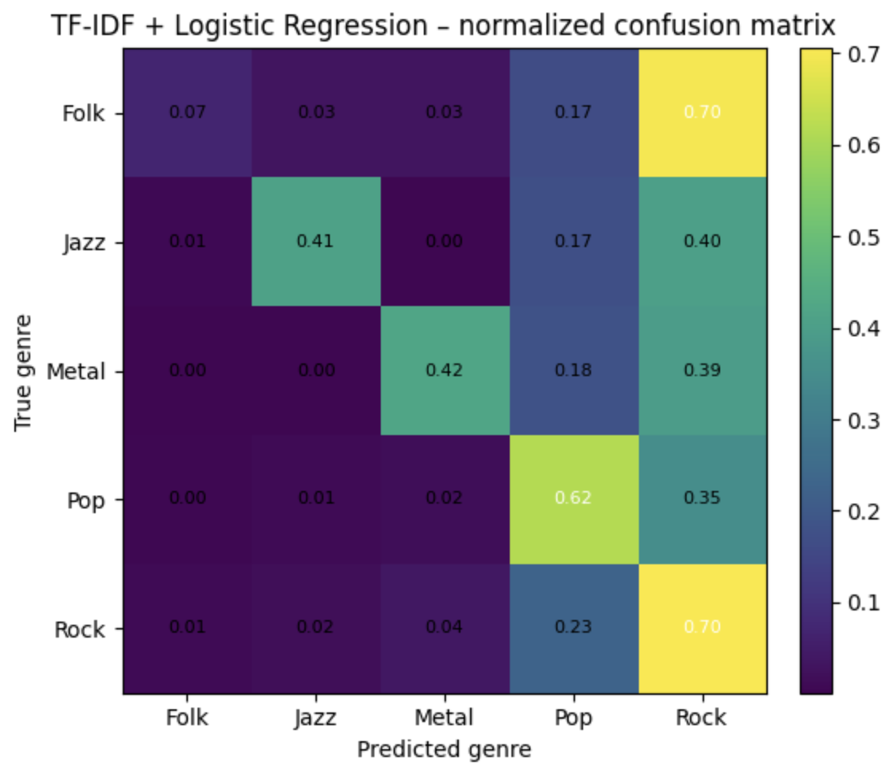
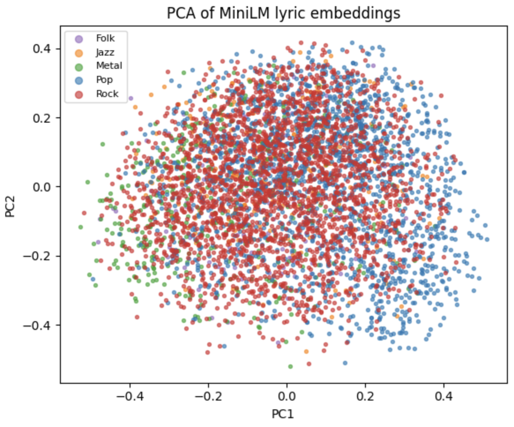
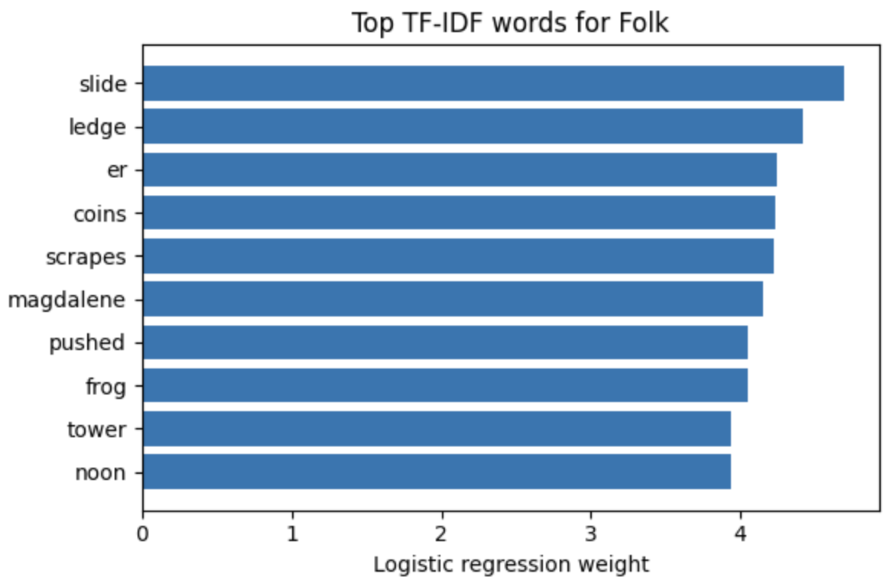

# Lyrics Genre Classifier

Predicts a song’s genre from **lyrics text only** (no audio).  
Labels: **Folk, Jazz, Metal, Pop, Rock**.

**TL;DR takeaway:** A strong classic baseline (**TF-IDF**) matches or beats “modern” embeddings on this task, and many errors collapse into **Rock** (the model’s “magnet” class).

## Quick links

- Slides (project overview + results, Google Slides):  
  https://docs.google.com/presentation/d/10pTTQb_L21_sDHcCswdqTa61122DklkoD4eUYz3HnkM/edit?usp=sharing
- Slides (PDF in this repo): [`lyrics-genre-classifier-slides.pdf`](lyrics-genre-classifier-slides.pdf)
- Report (PDF in this repo): [`lyrics_genre_classification_report.pdf`](lyrics_genre_classification_report.pdf)
- Main notebook: [`notebooks/lyrics_genre_project.ipynb`](notebooks/lyrics_genre_project.ipynb)

Key visuals (in this repo):
- PCA of MiniLM embeddings: [`assets/figures/pca_minilm_embeddings.png`](assets/figures/pca_minilm_embeddings.png)
- Normalized confusion matrix (TF-IDF + LR): [`assets/figures/confusion_matrix_tfidf_lr.png`](assets/figures/confusion_matrix_tfidf_lr.png)
- Top TF-IDF words (example: Folk): [`assets/figures/top_tfidf_words_folk.png`](assets/figures/top_tfidf_words_folk.png)

---

## Results (held-out test set)

I keep the classifier fixed (**multiclass logistic regression**) and only change the feature representation.

| Features | Test accuracy | Test macro-F1 |
|---|---:|---:|
| TF-IDF (20k vocab) | 0.6096 | 0.4732 |
| MiniLM embeddings (384d) | 0.6090 | 0.4426 |
| MiniLM + Autoencoder (64d latent) | 0.5939 | 0.3938 |

**Interpretation:** Accuracy is similar for TF-IDF and MiniLM, but TF-IDF wins on macro-F1. The autoencoder compression loses signal for this label set.

---

## Confusion matrix (TF-IDF + Logistic Regression)



Key failure modes (what the plot shows):
- **Rock is the “magnet” class:** many non-Rock songs get predicted as Rock.
- **Folk → Rock** is especially common, suggesting overlapping lyric/style cues under bag-of-words features.
- **Jazz and Metal** also drift toward Rock often, while **Pop** is more separable but still confuses with Rock.

---

## Visual intuition checks

### PCA of MiniLM embeddings (2D projection)



What this suggests: genres overlap heavily in embedding space (at least in 2D PCA), which aligns with why embeddings did not clearly outperform TF-IDF on macro-F1.

---

## Example feature inspection (TF-IDF)



What this suggests: the model is learning genre-associated vocabulary patterns, but many words are not genre-unique, which can contribute to cross-genre confusion.

---

## Data and split

Dataset: Kaggle “Multi-Lingual Lyrics for Genre Classification” (Matei Bejan)  
https://www.kaggle.com/datasets/mateibejan/multilingual-lyrics-for-genre-classification

In my runs, I use `train.csv` only and rename it to:
- `data/lyrics_train.csv`

Split (stratified):
- Train: 30k
- Validation: 10k (tune regularization `C` using macro-F1)
- Test: 10k (final evaluation)

Note: the raw dataset is not included in this repo because it is large (hundreds of MB).

---

## What I compared

All models use logistic regression; only the representation changes:
1. TF-IDF (bag of words, capped at ~20k features)
2. MiniLM sentence embeddings (384d)
3. MiniLM embeddings compressed with a small MLP autoencoder (latent 64d)

---

## Repo structure

- `notebooks/lyrics_genre_project.ipynb`  
  End-to-end pipeline: preprocessing → features → training → evaluation → plots.

- `assets/figures/`  
  Saved figures used in the README / slides.

- `data/`  
  Local-only (not tracked). Put `lyrics_train.csv` here.

---

## How to run

1. Download the dataset from Kaggle.
2. Put `train.csv` into `data/` and rename to `lyrics_train.csv`.
3. Open and run:
   - `notebooks/lyrics_genre_project.ipynb`

Optional: create an env and install deps (example):
```bash
pip install -U pandas numpy scikit-learn matplotlib sentence-transformers torch
```

## Notes / what I learned

- TF-IDF is a surprisingly strong baseline for lyric-only classification.
- Embeddings are not automatically “better”; representation choice depends on the task and evaluation metric (macro-F1 mattered here).
- The largest errors concentrate into Rock, suggesting genre boundaries are fuzzy from lyrics alone, and class imbalance or label noise may play a role.

Reproducibility note: results can shift slightly with different random seeds / splits, but the overall ranking (TF-IDF ≥ MiniLM, autoencoder worst) was consistent in my runs.
